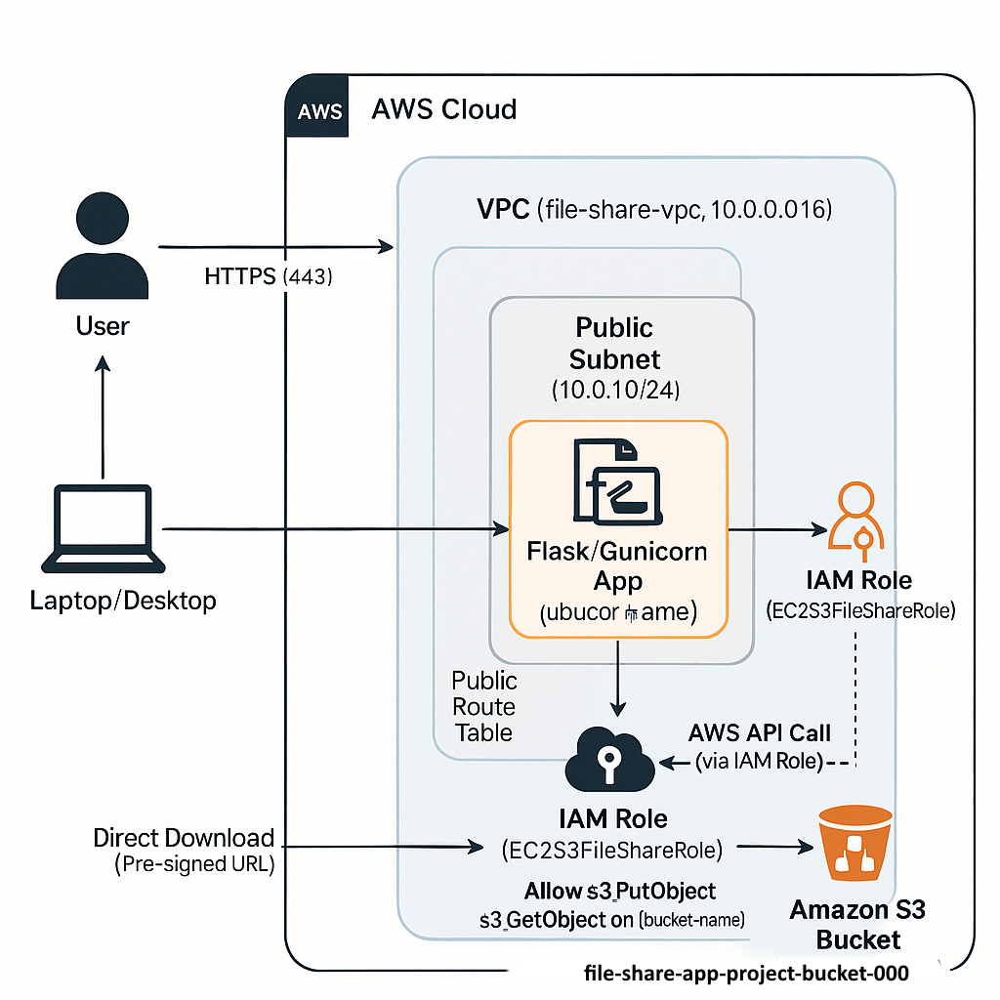

# Simple File Share - Cloud Project

A lightweight file sharing web application built on AWS cloud services. This project provides an easy-to-use interface for uploading, storing, and sharing files securely in the cloud.

## 📸 Screenshot *(hosted on our System)* 🖼️ 🎉

We are proud to showcase our application in action! Here's a glimpse of the user interface:


## 🌟 Features

- **Simple Web Interface**: Clean, responsive design for uploading files through a web browser
- **Secure File Storage**: All files stored securely in Amazon S3 buckets
- **Temporary Download Links**: Time-limited secure links for file sharing
- **File Management**: View, search, and delete your uploaded files
- **File Type Filtering**: Support for common file types (images, documents, PDFs, etc.)
- **User Feedback System**: Built-in feedback mechanism for user suggestions and issue reporting

## ⚙️ Architecture

This application uses a multi-tier AWS architecture:

- **Frontend**: HTML, CSS, JavaScript with Flask templates
- **Backend**: Python Flask web server running on EC2
- **Storage**: Amazon S3 bucket for secure file storage
- **Networking**: Custom VPC with appropriate security groups
- **Security**: IAM roles for secure S3 access from EC2  



## 🚀 Deployment

The application is designed to be deployed on AWS infrastructure:

1. **EC2 Instance**: Hosts the Flask web application
2. **S3 Bucket**: Provides scalable object storage for files
3. **IAM Role**: Grants EC2 instance secure access to S3 resources
4. **Security Groups**: Control network traffic to the application

### Installation Steps

1. Clone the repository to your EC2 instance:

   ```bash
   git clone https://github.com/abdallahsaber065/cloud-project.git app
   cd app
   ```

2. Create a virtual environment and install dependencies:

   ```bash
   python3 -m venv venv
   source venv/bin/activate
   pip install -r requirements.txt
   ```

3. Set the required environment variables:

   ```bash
   export S3_BUCKET_NAME="your-s3-bucket-name"
   export AWS_REGION="your-aws-region"
   ```

4. Run the application:

   ```bash
   # For development
   python app.py
   
   # For production (using Waitress)
   waitress-serve --host 0.0.0.0 --port 80 app:app
   ```

5. Access the application through your EC2 instance's public IP or domain.

## 🔒 Security Considerations

- Files are stored privately in S3 and accessed via time-limited presigned URLs
- EC2 uses IAM role for S3 access (no hardcoded credentials)
- Security groups restrict network access to the application

## 👥 Team Members & Roles

| Name               | Role                   | Responsibilities                                                       |
| ------------------ | ---------------------- | ---------------------------------------------------------------------- |
| Nour Kamal         | AWS Account Setup      | Created and configured AWS account                                     |
| Loay Mohamed       | EC2 & IAM Setup        | Launched EC2, configured IAM roles                                     |
| Abdelrahman Hamada | S3 & File Handling     | Created S3 bucket, implemented file operations                         |
| Abdullah Saber     | Web App Development    | Built web interface and backend logic                                  |
| Ahmed Ihaab        | VPC & Testing          | Network setup, testing, documentation                                  |
| Yousef Bakr        | Test and Documentation | Tested the app, ensured functionality, and compiled the project report |

## 🖥️ Pages & Features

1. **Home Page**: File upload interface
2. **Files Page**: View and manage uploaded files
3. **Search Page**: Find files with advanced filtering
4. **Feedback Page**: Submit suggestions or report issues

## 📋 Project Requirements

This project was created as part of a cloud computing course assignment with the following requirements:

- Create a simple file sharing web application on AWS
- Use EC2 for hosting and S3 for file storage
- Implement IAM roles for secure access management
- Configure VPC for network security
- Implement basic file upload and download functionality

## 💡 Bonus Features Implemented

- **File Listing**: View all uploaded files with metadata
- **Enhanced UI**: Applied modern HTML/CSS styling
- **Search Functionality**: Find files by name, type, or date
- **Feedback System**: Built-in communication channel with EmailJS

## 📝 License

This project is created for educational purposes as part of a cloud computing course.
